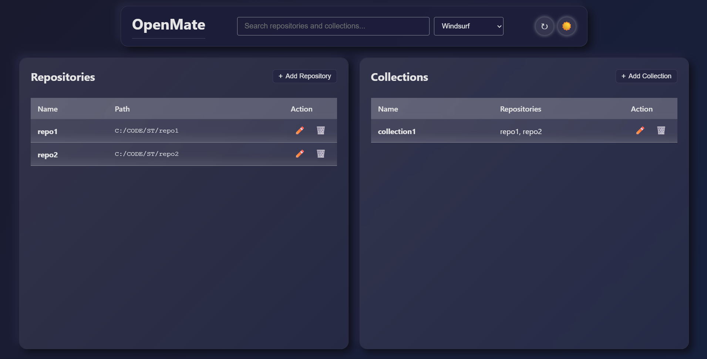
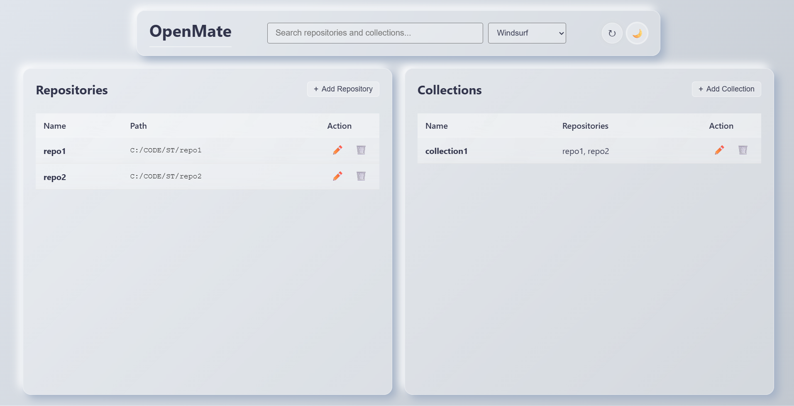
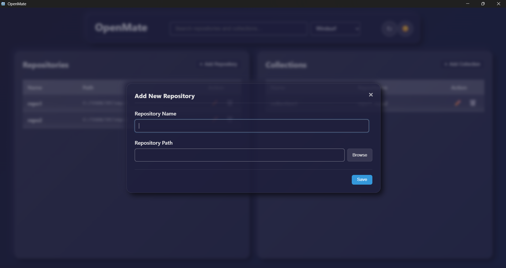
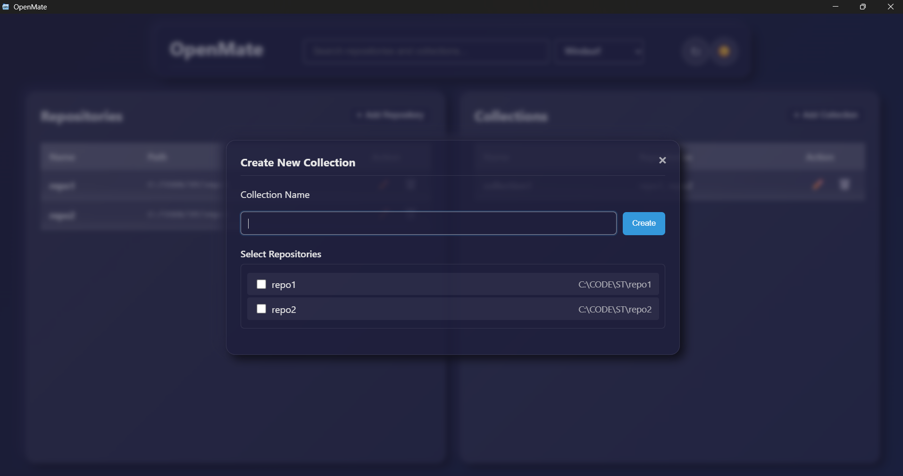

# OpenMate (`om`)


[](https://github.com/vivekvpai/OpenMate)
[](https://www.npmjs.com/package/openmate)
[](https://www.npmjs.com/package/openmate)
[](https://github.com/vivekvpai/OpenMate)
[](https://github.com/vivekvpai/OpenMate/blob/main/LICENSE)

A fast and friendly CLI tool to manage and open your local repositories in **VS Code**, **Windsurf**, **Cursor**, **IntelliJ IDEA**, or **PyCharm** with quick shortcuts. Perfect for developers who frequently switch between projects.

> **Note:** In this context, **repository** refers to your **local project folder** stored on your computer, not remote (GitHub/GitLab/Bitbucket) repositories.

---

# OpenMate UI

OpenMate UI is a desktop application that allows you to manage and open your local repositories in your favorite editor with quick shortcuts.

> **Note:** supports windows for now

### Download OpenMate UI from [here](https://github.com/vivekvpai/OpenMate/releases).

## ✅ Features

- Add and store repository paths by name
- Initialize current directory as a repository with `om init <name>`
- Open repositories in your favorite editor:
  - **VS Code** (`om vs <name>`)
  - **Windsurf** (`om ws <name>`)
  - **Cursor** (`om cs <name>`)
  - **IntelliJ IDEA** (`om ij <name>`)
  - **PyCharm** (`om pc <name>`)
- Smart suggestions when typing partial repository names:
  - Shows matching repositories and collections as you type partial name and hit enter
  - Displays repositories and collections in separate, clearly labeled lists
  - Works with all editor commands (vs, ws, cs, ij, pc)
- Update or remove stored repos
- Print the stored path of a repo
- List all stored repositories and collections
- **Collections**:
  - Group related repositories together and open them all at once
  - View detailed repository list for a specific collection (`om list <collection>`)
  - List all collections with `om list -c`
- Lightweight and super easy to use
- **UI**: OpenMate UI is a desktop application that allows you to manage and open your local repositories in your favorite editor with quick shortcuts. (supports windows for now)

---

## 📌 Notes & OS Compatibility

- Supported editors: **VS Code**, **Windsurf**, **Cursor**, **IntelliJ IDEA**, and **PyCharm**.
- On **Windows**, use double quotes for paths.

---

## 📦 Installation

Install globally via **npm**:

```bash
npm install -g openmate
```

Verify installation:

```bash
om --version
```

---

## ⚡ Usage

### **Available Commands**

#### Repository Management

```
om init <name>                        Initialize current directory as a repository
om add <name> "<path/to/repo>"        Add a repo (no duplicate names)
om update <name> "<new/path>"         Update stored path for existing name
om remove <name>                      Remove stored repo
om list                               List all stored repos
om path <name>                        Print the stored path
```

### **Examples**

#### Initialize Current Directory as a Repository

Navigate to your project directory and run:

```bash
om init repo1
```

**Output:**

```
✅ Added "repo1" -> C:/Projects/repo1
```

Now you can open this repository in your default editor using:

```bash
om vs repo1  # Opens in VS Code
# or
om ws repo1  # Opens in Windsurf

```

#### Collection Management

```
om add -c <name> <repo1,repo2,...>    Add/update a collection of repos
om update -c <name> <repo1,repo2,...> Update a collection's repos
om remove -c <name>                   Remove a collection
om list -c                            List all collections
om list <collection>                  Show details of a specific collection
```

#### Open Repositories/Collections

```
om vs <name>                          Open repo/collection in VS Code
om ws <name>                          Open repo/collection in Windsurf
om cs <name>                          Open repo/collection in Cursor
om ij <name>                          Open repo/collection in IntelliJ IDEA
om pc <name>                          Open repo/collection in PyCharm
```

---

### **Examples**

Below are some practical examples of how to use **OpenMate** for managing repositories and collections.

---

#### ✅ **Basic Repository Usage**

A **repository** is a single project folder on your local machine. You can add, update, remove, and open repositories using short commands.

```bash
# Add a repository with a short name (alias)
om add <repo-name> "<path-to-repo>"

# Open the repository in VS Code
om vs <repo-name>

# Open the repository in Windsurf
om ws <repo-name>

# Open the repository in Cursor
om cs <repo-name>
```

**Update or remove a repository:**

```bash
# Update the path of an existing repository
om update <repo-name> "<new-path-to-repo>"

# Remove the repository
om remove <repo-name>
```

---

#### ✅ **Listing Repositories and Collections**

Use the `list` command to view repositories and collections:

```bash
# List all repositories and collections
om list

# List only repositories
om list -r

# List only collections
om list -c
```

View details of a specific collection:

```bash
om list <collection-name>
# Example Output:
# ✅ Collection "<collection-name>":
#    repo1, repo2, repo3
```

If the collection doesn’t exist:

```bash
om list <nonexistent>
# Output:
# ❌ Collection "<nonexistent>" not found.
# Available collections:
#   1. frontend
#   2. backend
```

---

#### ✅ **Working with Collections**

A **collection** is a group of related repositories you can manage together.

**Create a collection:**

```bash
om add -c <collection-name> repo1,repo2,repo3,repo4
```

Here:

- `-c` indicates you are adding a collection.
- `<collection-name>` is the name of the collection.
- `repo1,repo2,repo3,repo4` are the repository names in the collection.

**Open all repositories in a collection:**

```bash
om vs <collection-name>
```

**Update a collection (add/remove repos):**

```bash
om update -c <collection-name> repo1,repo2,repo3,repo4,repo5
```

**List all collections:**

```bash
om list -c
```

**Remove a collection:**

```bash
om remove -c <collection-name>
```

---

### **Sample Outputs**

#### `om list`

When you run `om list`, it shows all stored repositories and collections:

```
Stored repos:
┌─────┬──────────┬───────────────────────────────┐
│ #   │ Name     │ Repo Path                     │
├─────┼──────────┼───────────────────────────────┤
│ 1   │ repo1    │ C:\Projects\repo1             │
│ 2   │ repo2    │ C:\Projects\repo2             │
│ 3   │ repo3    │ C:\Projects\repo3             │
│ 4   │ repo4    │ C:\Projects\repo4             │
└─────┴──────────┴───────────────────────────────┘

Collections:
┌─────┬────────────────────┬──────────┬───────────────────────────┐
│ #   │ Name               │ Repos    │ Repository Names          │
├─────┼────────────────────┼──────────┼───────────────────────────┤
│ 1   │ collection1        │ 2        │ repo1, repo2              │
│ 2   │ collection2        │ 2        │ repo3, repo4              │
└─────┴────────────────────┴──────────┴───────────────────────────┘
```

---

### **List Only Repositories**

```bash
om list -r
```

**Sample Output:**

```
Stored Repositories:
┌─────┬──────────┬───────────────────────────────┐
│ #   │ Name     │ Repo Path                     │
├─────┼──────────┼───────────────────────────────┤
│ 1   │ repo1    │ C:\\Projects\\repo1           │
│ 2   │ repo2    │ C:\\Projects\\repo2           │
│ 3   │ repo3    │ C:\\Projects\\repo3           │
└─────┴──────────┴───────────────────────────────┘
```

---

### **List Only Collections**

```bash
om list -c
```

**Sample Output:**

```
Collections:
┌─────┬──────────────┬──────────┬───────────────────────────────┐
│ #   │ Name         │ Repos    │ Repository Names              │
├─────┼──────────────┼──────────┼───────────────────────────────┤
│ 1   │ frontend     │ 4        │ repo1, repo2, repo3, repo4    │
│ 2   │ backend      │ 2        │ repo5, repo6                  │
└─────┴──────────────┴──────────┴───────────────────────────────┘
```

---

### **List a Specific Collection**

```bash
om list frontend
```

**Sample Output:**

```
Collection: frontend
Repositories:
┌─────┬──────────┬───────────────────────────────┐
│ #   │ Name     │ Repo Path                     │
├─────┼──────────┼───────────────────────────────┤
│ 1   │ repo1    │ C:\\Projects\\repo1           │
│ 2   │ repo2    │ C:\\Projects\\repo2           │
│ 3   │ repo3    │ C:\\Projects\\repo3           │
│ 4   │ repo4    │ C:\\Projects\\repo4           │
└─────┴──────────┴───────────────────────────────┘
```

---

### **Smart Suggestions**

When you type a partial repository or collection name, OpenMate will show you matching suggestions:

```bash
om ws st
```

**Sample Output:**

```
❌ No exact match for "st". Did you mean one of these?

Suggestions:
Repositories:   stagentdash  stapp  stappdocs  stboxesmfe  stdaisy  stsearch
Collections:    stagent  stsite  stuser
```

### **When Collection Doesn't Exist**

```bash
om list nonexistent
```

**Sample Output:**

```
❌ Collection "nonexistent" not found.
Available collections:
  1. frontend
  2. backend
```

---

### **OpenMate UI**

OpenMate UI is a desktop application that allows you to manage and open your local repositories in your favorite editor with quick shortcuts.

[Download](https://github.com/pai-ui/openmate/releases)

**Features:**

> supports all the cli features and also has some extra features.

- Add repositories
- Edit repositories
- Add collections
- Edit collections
- Open repositories
- Open collections

**Extra Features:**

- Dark/Light mode
- Select default editor
- Search repositories and collections

**Screenshots**

- Main Window
  
  

- Add Repository
  

- Edit Repository
  

- Add Collection
  

- Edit Collection
  

### **Key Tips**

- **Use short names (aliases)** for repositories for quick access.
- **Collections save time** when you work on multiple related repositories.
- **`om vs`**, **`om ws`**, and **`om cs`** let you choose your editor (VS Code, Windsurf, or Cursor).

---

## 🔧 Requirements

### **General**

- **Node.js** (>= 14.x)

### **Windows**

- **VS Code**, **Windsurf**, or **Cursor** installed and added to PATH
- CLI commands `code`, `windsurf`, or `cursor` must be available in terminal

### **macOS**

- **VS Code**, **Windsurf**, or **Cursor** installed in `/Applications`
- No CLI needed; uses `open -a` internally

---

## 📂 How It Works

- Stores repo names and paths in a local JSON file (`~/.openmate/repos.json`)
- Uses system commands to open editors
- macOS uses `open -a <AppName>` for launching apps

---

## 📝 License

MIT License © 2025 Pai
